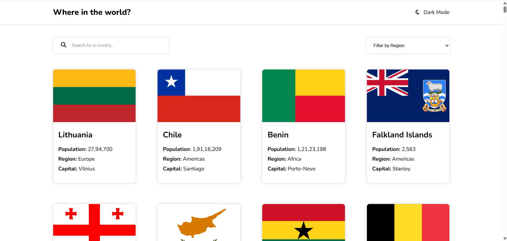

# 🌍 Countries API Explorer

[](https://deepwiki.com/Diwaker-kanojia/countries_api)  
[](https://reactjs.org/)  
[](https://vitejs.dev/)  
[](https://axios-http.com/)  

A responsive **React.js** application 🌐 that lets users explore countries around the world using the **REST Countries API**. Includes search, region filter, detailed country pages, dark mode, and responsive design.

[🚀 Live Demo](https://countries-api-six-gamma.vercel.app/)


## ✨ Features

- 🔎 **Search**: Search for countries by name dynamically  
- 🌎 **Filter**: Filter countries by region  
- 📄 **Detailed Country View**: View population, native name, currencies, languages, borders, and flags  
- 🧭 **Border Country Navigation**: Click bordering countries to explore them  
- 🌓 **Dark Mode**: Toggle light/dark themes, saved in local storage  
- ⚡ **Shimmer Loading Placeholders**: Smooth loading experience  
- 📱 **Responsive Design**: Works on mobile, tablet, and desktop  


## 🛠️ Tech Stack

| Feature         | Technology                  |
|-----------------|----------------------------|
| ⚛️ Framework     | React                      |
| 🔗 Routing       | React Router DOM           |
| 📡 HTTP Client   | Axios                      |
| 💻 Styling       | Plain CSS (with CSS Variables for theming) |
| 🛠 Build Tool     | Vite                       |
| ✅ Linting       | ESLint                     |


## 🖼 Screenshots



## 🚀 Getting Started

### Prerequisites

- Node.js ≥ 16  
- npm or yarn  

### Installation

```bash
# Clone the repository
git clone https://github.com/diwaker-kanojia/countries_api.git

# Navigate to project folder
cd countries_api

# Install dependencies
npm install


